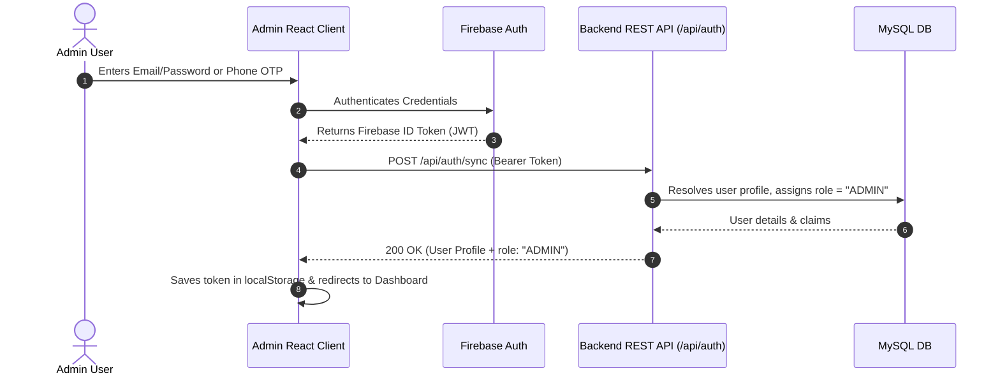
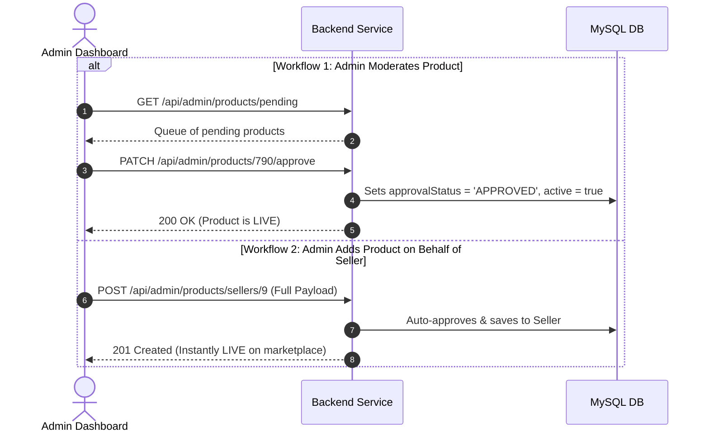
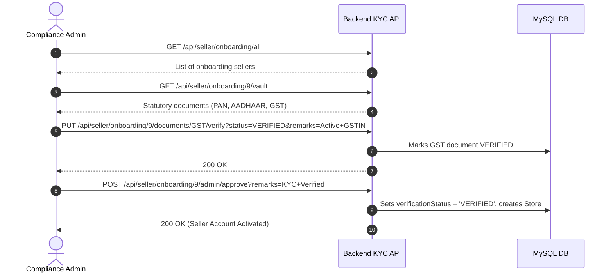

# HINCHMART B2B ADMIN OPERATIONS CONSOLE
## Complete Technical API Specification & Frontend Handoff Guide

**Document Version:** 3.1.0 (Production Enterprise Spec)  
**Target Audience:** Admin Frontend Engineering Team (`admin-frontend`), Backend Engineering Team, QA, Product Architecture  
**Authentication:** Firebase Auth ID Token (JWT Bearer) + Role-Based Access Control (`ADMIN`)  
**Base URL:** `https://api.hinchmart.com/api` (Local Dev: `http://localhost:8080/api` or proxy `/api`)

---

## 1. Global Authentication & Session Setup

Every API request from the Admin Dashboard must include the Firebase Admin JWT token:

```http
Authorization: Bearer <FIREBASE_ADMIN_JWT_TOKEN>
Content-Type: application/json
```



### 1.1 Sync Authenticated Profile
- **Endpoint:** `POST /api/auth/sync`
- **Request Body:**
  ```json
  {
    "name": "Super Administrator",
    "phone": "+919876543210"
  }
  ```
- **Response (200 OK):**
  ```json
  {
    "success": true,
    "message": "User synchronized successfully",
    "data": {
      "userId": 1,
      "firebaseUid": "FIREBASE_ADMIN_UID_12345",
      "email": "admin@hinchmart.com",
      "name": "Super Administrator",
      "phone": "+919876543210",
      "role": "ADMIN",
      "sellerId": null,
      "claims": {
        "role": "ADMIN",
        "admin": true,
        "permissions": ["ALL"]
      }
    }
  }
  ```

### 1.2 Get Current Session Profile
- **Endpoint:** `GET /api/auth/me`
- **Response (200 OK):**
  ```json
  {
    "success": true,
    "data": {
      "userId": 1,
      "email": "admin@hinchmart.com",
      "name": "Super Administrator",
      "role": "ADMIN"
    }
  }
  ```

---

## 2. 4-Tier Catalog Management (Global Marketplace Catalog)

$$\text{Category (L1)} \longrightarrow \text{Subcategory (L2)} \longrightarrow \text{Brand (L3)} \longrightarrow \text{Product (L4)}$$

### 2.1 Tier 1: Category Management (`/api/categories`)
| Method | Endpoint | Description |
|---|---|---|
| `GET` | `/api/categories?includeSubcategories=true` | List all categories with nested subcategories. |
| `GET` | `/api/categories/{id}` | Get single category by ID. |
| `POST` | `/api/categories` | Create a new category. |
| `PUT` | `/api/categories/{id}` | Update category details. |
| `DELETE` | `/api/categories/{id}` | Delete category. |

**Create Category Request Body (`POST /api/categories`):**
```json
{
  "name": "Textile Colors & Chemicals",
  "slug": "textile-colors-chemicals",
  "imageUrl": "https://storage.hinchmart.com/categories/textiles.jpg",
  "sortOrder": 1,
  "active": true
}
```

### 2.2 Tier 2: Subcategory Management (`/api/subcategories`)
| Method | Endpoint | Description |
|---|---|---|
| `GET` | `/api/subcategories?categoryId={id}` | List subcategories (filtered by Category). |
| `GET` | `/api/subcategories/{id}` | Get subcategory details. |
| `POST` | `/api/subcategories` | Create subcategory under a Category. |
| `PUT` | `/api/subcategories/{id}` | Update subcategory. |
| `DELETE` | `/api/subcategories/{id}` | Delete subcategory. |

**Create Subcategory Request Body (`POST /api/subcategories`):**
```json
{
  "categoryId": 10,
  "name": "Reactive Dyes",
  "slug": "reactive-dyes",
  "imageUrl": "https://storage.hinchmart.com/subcategories/reactive.jpg",
  "sortOrder": 1,
  "active": true
}
```

### 2.3 Tier 3: Brand Management (`/api/brands`)
| Method | Endpoint | Description |
|---|---|---|
| `GET` | `/api/brands?subcategoryId={id}&search={term}` | List brands with filters. |
| `GET` | `/api/brands/{id}` | Get brand details. |
| `POST` | `/api/brands` | Create new brand. |
| `PUT` | `/api/brands/{id}` | Update brand. |
| `DELETE` | `/api/brands/{id}` | Delete brand. |

**Create Brand Request Body (`POST /api/brands`):**
```json
{
  "subcategoryId": 101,
  "name": "ColorCraft India",
  "slug": "colorcraft-india",
  "logoUrl": "https://storage.hinchmart.com/brands/colorcraft.png",
  "website": "https://colorcraft.com"
}
```

### 2.4 Category Requests Moderation (Submitted by Sellers)
| Method | Endpoint | Description |
|---|---|---|
| `GET` | `/api/seller/category-requests` | View all category requests from sellers. |
| `PATCH` | `/api/admin/category-requests/{id}/approve` | Approve category request. |
| `PATCH` | `/api/admin/category-requests/{id}/reject` | Reject request with reason payload `{ "remarks": "..." }`. |

---

## 3. Product Moderation & Assisted Seller Catalog Management

The Admin has two primary capabilities:
1. **Moderating seller-submitted products** (Approve / Reject).
2. **Managing any seller's catalog directly** (Assisted onboarding for uneducated or non-tech sellers).



### 3.1 Product Moderation Endpoints
| Method | Endpoint | Description |
|---|---|---|
| `GET` | `/api/admin/products/pending` | Fetch pending queue waiting for approval. |
| `GET` | `/api/admin/products/{id}` | Get product details for review. |
| `PATCH` | `/api/admin/products/{id}/approve` | Approve product (`PENDING` $\rightarrow$ `APPROVED`, `active: true`). |
| `PATCH` | `/api/admin/products/{id}/reject` | Reject product with `{ "reason": "..." }`. |

### 3.2 Assisted Seller Catalog Management Endpoints
The Admin can perform complete CRUD and inventory operations directly inside any seller's catalog:

| Method | Endpoint | Description |
|---|---|---|
| `POST` | `/api/admin/products/sellers/{sellerId}` | Create product for seller (Auto-approved & instantly live). |
| `GET` | `/api/admin/products/sellers/{sellerId}` | View all products of this specific seller with filters. |
| `PUT` | `/api/admin/products/sellers/{sellerId}/{productId}` | Update product details/pricing for this seller. |
| `DELETE` | `/api/admin/products/sellers/{sellerId}/{productId}` | Delete product from this seller's catalog. |

**Create Product for Seller Payload (`POST /api/admin/products/sellers/{sellerId}`):**
```json
{
  "brandId": 45,
  "storeId": 12,
  "title": "ColorCraft Rose Pink Reactive Dye 1KG",
  "sku": "SKU-PINK-001",
  "description": "High purity industrial reactive dye for cotton and fabric dyeing.",
  "price": 850.00,
  "mrp": 977.00,
  "unit": "KG",
  "moq": 5,
  "stockQty": 100,
  "is24HourDelivery": true,
  "images": [
    "https://storage.hinchmart.com/products/rose_dye.png"
  ],
  "bulkPricingTiers": [
    { "minQty": 10, "discountPercentage": 5.0 },
    { "minQty": 50, "discountPercentage": 12.0 }
  ],
  "specifications": {
    "Form": "Powder",
    "Purity": "99.2%",
    "Solubility": "Water Soluble",
    "HSN": "3204"
  }
}
```

**Response (201 Created):**
```json
{
  "success": true,
  "message": "Product created successfully for seller",
  "data": {
    "id": 791,
    "productId": 791,
    "sellerId": 9,
    "storeId": 12,
    "title": "ColorCraft Rose Pink Reactive Dye 1KG",
    "sku": "SKU-PINK-001",
    "price": 850.00,
    "mrp": 977.00,
    "unit": "KG",
    "moq": 5,
    "stockQty": 100,
    "status": "APPROVED",
    "approvalStatus": "APPROVED",
    "active": true,
    "createdAt": "2026-09-09T14:45:00"
  }
}
```

---

## 4. Seller KYC, Onboarding & Statutory Compliance Vault



### 4.1 KYC Review Endpoints
| Method | Endpoint | Description |
|---|---|---|
| `GET` | `/api/seller/onboarding/all` | List all onboarding seller applications. |
| `GET` | `/api/seller/onboarding/{sellerId}/summary` | Get structured onboarding profile summary. |
| `GET` | `/api/seller/onboarding/{sellerId}/vault` | Get statutory document files (PAN, AADHAAR, GST). |
| `PUT` | `/api/seller/onboarding/{sellerId}/documents/{docType}/verify` | Verify individual document (`status`: `VERIFIED` / `REJECTED`). |
| `POST` | `/api/seller/onboarding/{sellerId}/admin/approve` | Approve Seller Account (Creates active store & enables selling). |
| `POST` | `/api/seller/onboarding/{sellerId}/admin/reject` | Reject seller application with remarks. |

**Verify Document Query:**
`PUT /api/seller/onboarding/{sellerId}/documents/{docType}/verify?status=VERIFIED&remarks=NSDL+Matched`
- `docType`: `PAN` | `AADHAAR` | `GST`
- `status`: `VERIFIED` | `REJECTED`
- `remarks`: Optional verification notes

---

## 5. Marketplace Store Discovery & Status Control

| Method | Endpoint | Description |
|---|---|---|
| `GET` | `/api/stores?search={term}&page=1&limit=20` | Search & List Stores by Name (rating, logo, banner, min order). |
| `GET` | `/api/stores/{slugOrId}` | Get store profile details. |
| `GET` | `/api/stores/{slugOrId}/categories` | Get store's Category & Subcategory tree with live product counts. |
| `GET` | `/api/stores/{slugOrId}/products?categoryId=...&subcategoryId=...` | List products locked to this store. |
| `PATCH` | `/api/admin/stores/{id}/status` | Change store status (`ACTIVE`, `SUSPENDED`, `CLOSED`). |

**Change Store Status Payload (`PATCH /api/admin/stores/{id}/status`):**
```json
{
  "status": "ACTIVE",
  "remarks": "Annual license verified"
}
```

---

## 6. Orders, Invoicing & Logistics Management

| Method | Endpoint | Description |
|---|---|---|
| `GET` | `/api/orders?status=PROCESSING&page=1&limit=20` | List all orders with filters (`status`, `paymentStatus`, `search`). |
| `GET` | `/api/orders/{id}` | Get full order details (buyer info, items, CGST/SGST/IGST breakdown). |
| `PATCH` | `/api/orders/{id}/status` | Update fulfillment state (`CONFIRMED`, `PROCESSING`, `SHIPPED`, `DELIVERED`, `CANCELLED`). |
| `GET` | `/api/orders/{id}/invoice` | Download sequential per-store GST PDF invoice. |

**Update Order Status Payload (`PATCH /api/orders/{id}/status`):**
```json
{
  "status": "SHIPPED",
  "trackingNumber": "VRL-LOG-891023",
  "carrier": "VRL Logistics"
}
```

---

## 7. B2B Request for Quotation (RFQ) Tendering

| Method | Endpoint | Description |
|---|---|---|
| `GET` | `/api/rfqs` | List all buyer procurement RFQs. |
| `GET` | `/api/rfqs/{id}` | View RFQ specifications and requirements. |
| `GET` | `/api/rfqs/{id}/quotations` | List all seller quotes submitted for this RFQ. |
| `POST` | `/api/rfqs/quotes/{id}/accept` | Accept quotation and convert RFQ into confirmed Order. |

---

## 8. Marketing Banners Management

| Method | Endpoint | Description |
|---|---|---|
| `GET` | `/api/banners?position=HOME_HERO&active=true` | List banners with position filter. |
| `POST` | `/api/banners` | Create banner with landing target. |
| `PUT` | `/api/banners/{id}` | Update banner title, image, or link. |
| `DELETE` | `/api/banners/{id}` | Delete banner. |

**Create Banner Payload (`POST /api/banners`):**
```json
{
  "title": "Mega Industrial Chemicals Expo 2026",
  "subtitle": "Direct Factory Wholesale Rates",
  "ctaText": "Explore Catalog",
  "imageUrl": "https://storage.hinchmart.com/banners/chemicals_banner.jpg",
  "linkType": "CATEGORY",
  "linkValue": "textile-colors-chemicals",
  "position": "HOME_HERO",
  "sortOrder": 1,
  "active": true
}
```
*Positions: `HOME_HERO` | `CATEGORY_SPOTLIGHT` | `DEALS_CAROUSEL` | `BUYER_DASHBOARD`*

---

## 9. AWS S3 Media Upload Engine

Send `multipart/form-data` with key `file` (or `files` for multiple):

| Purpose | Method | Endpoint | Parameter |
|---|---|---|---|
| Single Product Photo | `POST` | `/api/images/products` | `file` |
| Multiple Product Gallery | `POST` | `/api/images/multiple?folder=products` | `files` |
| Category Banner | `POST` | `/api/images/categories` | `file` |
| Subcategory Image | `POST` | `/api/images/subcategories` | `file` |
| Store Banner / Logo | `POST` | `/api/images/banners` | `file` |
| KYC Documents (PDF/JPG) | `POST` | `/api/images/documents` | `file` |
| Delete S3 Asset | `DELETE` | `/api/images?key={key}` | URL query `key` |

**Upload Response Example (201 Created):**
```json
{
  "success": true,
  "message": "Image uploaded successfully",
  "data": {
    "url": "https://hinchmart-storage-191481838776-ap-south-2-an.s3.ap-south-2.amazonaws.com/products/1725875200_rose.png",
    "key": "products/1725875200_rose.png"
  }
}
```

---

## 10. Standard Error Response Contract

```json
{
  "success": false,
  "message": "Duplicate SKU: A product with SKU 'SKU-PINK-001' already exists.",
  "status": 409,

  
  "errors": {
    "sku": "SKU code must be unique across the catalog."
  }
}
```

### HTTP Status Code Meanings:
- `200 OK`: Successful fetch / update / state transition
- `201 Created`: Successfully created entity
- `400 Bad Request`: Missing mandatory fields or malformed payload
- `401 Unauthorized`: Missing, invalid, or expired Firebase ID token
- `403 Forbidden`: Authenticated user lacks `ADMIN` permissions
- `404 Not Found`: Entity not found
- `409 Conflict`: Duplicate SKU / slug or invalid state transition
- `413 Payload Too Large`: Media file exceeds 15 MB
- `500 Internal Server Error`: Unhandled server exception

---
*Prepared by HinchMart Engineering Architecture Team.*


i have used from moglix produtcs know https://www.moglix.com/, now want to do add spectificaons job in this proj, hw to do this give with example (from moglix Astral CPVC Pro SDR-11 50mm Pipe, M511110306 (Pack of 10)), , dont toucg & cgnge anthing jsy say